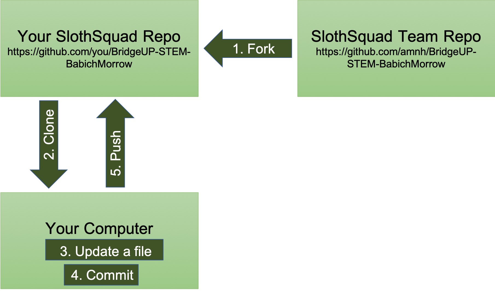

# SlothSquad

## Team Research Questions & Goals

### Research Questions

+ What environmental variables influence the range of the sloths?
+ How do the different species differ in their ranges?
+ How have sloth ranges changed over time and how will they continue to change in the future?

### Goals

+ Read and write R scripts to analyze spatial data
+ Understand the basics of machine learning
+ Understand how ecological concepts relate to programming

## Calendar

| Date   |      Topics      |  Materials |
|----------|-------------|------|
| **Week 1** | | |
  | October 9 |  <ul><li>Join the Sloth Squad! </li><li> R set-up </li><li> Questions for Dr. Blair |                           [R Set-up - slides](https://docs.google.com/presentation/d/1EsC6WLLg2vecp1zUkETEXVK2Ai168oAJrUcz23vlpj8/edit?usp=sharing)       [Dr. Blair's website](https://sites.google.com/site/maryeblair/home)   [Dr. Blair - Scientist at Work](https://scientistatwork.blogs.nytimes.com/tag/slow-loris/) |
  | October 11 | <ul><li> Meet Dr. Mary Blair! </li><li> Project Overview |                                                     [Questions for Dr. Blair](https://docs.google.com/document/d/14YUri2-jk7_R_H8OH7ouzHGdfD1sJqFb7CTERCC7NMs/edit?usp=sharing)    [Project Overview - slides](https://docs.google.com/presentation/d/1WHQqnFkMPRanS7SCgBz7Vu6U876s6jPJqvuFz_OkTFU/edit?usp=sharing) |
| **Week 2** | | |
  | October 16 | <ul><li> Digging into R+GitHub :fork_and_knife: </li><li>  Introduction to R |                                 [Forking in GitHub and RStudio](https://github.com/amnh/BridgeUP-STEM-BabichMorrow/blob/master/lesson_plans/GitHub_Fork.md)   [Happy Git with R](http://happygitwithr.com/rstudio-git-github.html)   [Introduction to R - RMarkdown](https://github.com/amnh/BridgeUP-STEM-BabichMorrow/blob/master/lesson_plans/Intro_R/Introduction_to_R.Rmd) |
  | October 18 | <ul><li> Going outside! - GPS exploration </li><li> Syncing a fork </li><li> Introduction to spatial data in R |                                                                                                                             [GPS collection instructions](https://github.com/amnh/BridgeUP-STEM-BabichMorrow/blob/master/lesson_plans/GPS_CollectData.md)   [GPS R Markdown](https://github.com/amnh/BridgeUP-STEM-BabichMorrow/blob/master/lesson_plans/Intro_GPS/IntroGPS.Rmd) |
| **Week 3** | | |
  | October 23 | <ul><li> Syncing a fork - review </li><li> GPS in R continued |                                                 [GitHub Help: syncing a fork](https://help.github.com/articles/syncing-a-fork/)   [GPS R Markdown](https://github.com/amnh/BridgeUP-STEM-BabichMorrow/blob/master/lesson_plans/Intro_GPS/IntroGPS.Rmd)  |
  | October 25 | <ul><li> Hall of Biodiversity scavenger hunt </li><li> What is GBIF? |                                         [GBIF website](https://www.gbif.org) |
| **Week 4** | | |
  |October 30    :jack_o_lantern: Halloween Eve :chocolate_bar:  |                                                 <ul><li> UFO(+R) :alien: |                                                                                                     [UFO R Markdown](https://github.com/amnh/BridgeUP-STEM-BabichMorrow/blob/master/lesson_plans/Spooky_R/UFO_code.Rmd) |
  | November 1 | <ul><li> `ggplot2` tutorial </li><li> UFO(+R) continued </li><li> `spocc` package |                             [`ggplot2` tutorial](https://www.datacamp.com/courses/data-visualization-with-ggplot2-1) and [tutorial notes](https://github.com/amnh/BridgeUP-STEM-BabichMorrow/blob/master/lesson_plans/Spooky_R/ggplot2_Notes.md)   [`ggplot2` Cheatsheet](https://www.rstudio.com/wp-content/uploads/2015/03/ggplot2-cheatsheet.pdf)   [`spocc` package tutorial](https://github.com/amnh/BridgeUP-STEM-BabichMorrow/blob/master/lesson_plans/obtain_occ_data/spocc_tutorial.Rmd) |
| **Week 5** | | |
  | November 6    :us: Election Day :us:  | **No internship session today** |                                      Code in politics (and life) - [FiveThirtyEight](https://fivethirtyeight.com/) |
  | November 8 | <ul><li> Finish `spocc` tutorial </li><li> ~~Fast~~ facts about sloths |                                       [Sloth slides](https://docs.google.com/presentation/d/1h3dgXnZQpHdQW54hK1eR3cRHQ3shuDH3E7P_h1rnZKE/edit?usp=sharing) |
| **Week 6** | | |
  | November 13 | <ul><li> Subsetting data </li><li> Lines and polygons |                                                       [Sloth data cleaning - part 1](https://github.com/amnh/BridgeUP-STEM-BabichMorrow/blob/master/lesson_plans/process_occ_data/sloth_cleaning_pt1.Rmd)   [Return to GPS](https://github.com/amnh/BridgeUP-STEM-BabichMorrow/blob/master/lesson_plans/process_occ_data/GPS_PointLinePoly.Rmd)   [Sloth data cleaning - part 2](https://github.com/amnh/BridgeUP-STEM-BabichMorrow/blob/master/lesson_plans/process_occ_data/sloth_cleaning_pt2.Rmd) |
  | November 15 | <ul><li> Introduction to spatial thinning </li><li> `spThin` tutorial </li><li> Questions for Julia Tejada |   Sloth data cleaning - part 3   [Questions for Julia Tejada](https://docs.google.com/document/d/15rEqzpRAIuNE7CPi0UA2Lyxaw1sH1BPFmGaGWRG7JfY/edit?usp=sharing) |
| **Week 7** | | |
  | November 20 | <ul><li> Meet Julia Tejada! </li><li> `raster` package tutorial </li><li> What is WorldClim? |                 [`raster` tutorial](https://www.neonscience.org/primer-raster-data-r)   [WorldClim website](http://www.worldclim.org) |
  | November 22    :poultry_leg: Thanksgiving :maple_leaf:  | **No internship session today** | | 
| **Week 8** | | |
  | November 27 | <ul><li> WorldClim in R :earth_americas: | |
  | November 29 | <ul><li> Louise is visiting! | |
| **Week 9** | | |
  | December 4 | <ul><li> Presentation planning | |
  | December 6 | <ul><li> Work on presentations | |
| **Week 10** | | |
  | December 11 | <ul><li> Work on presentations | |
  | December 13 | Presentation Skills Workshop | |
| **Week 11** | | |
  | December 18 | <ul><li> Work on presentations | |
  | December 20 | **Winter Presentations!** | |

## Daily Git To Do

### Beginning of Session

Push your local changes:

+ Open Terminal and navigate to your folder for the forked repository
  + `pwd`: check current directory
  + `ls`: get a list of files in the current directory
  + `cd`: move to a new directory
+ See current status of Git: `git status`
+ If you have modified files, commit your changes
  + `git add .` to add all untracked files to your commit
  + Once you've added all the files, `git commit -m "whatever you want your message to be"`
+ Push your changes to your remote copy of the fork: `git push`

Sync your fork:

+ Fetch commits from upstream repository to get any updates: `git fetch upstream`
+ Check out your fork's local `master` branch: `git checkout master`
+ Merge the changes from `upstream/master` into your local `master` branch: `git merge upstream/master`
  + Will need to hit the escape key, then type `:wq` to get out of the text editor for the commit
+ Run `git push` one final time to push the merged changes to your remote fork

### End of Session

Push your local changes:

+ See current status of Git: `git status`
+ If you have modified files, commit your changes
  + `git add .` to add all untracked files to your commit
  + Once you've added all the files, `git commit -m "whatever you want your message to be"`
+ Push your changes to your remote copy of the fork: `git push`

