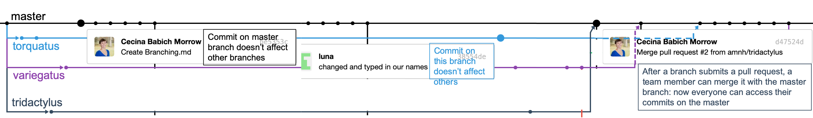

# Working with Branches :tanabata_tree:

Branches allow us to work on different versions of the code in parallel, without affecting the "main" copy of our code on the master branch. In software development, branches are often used to work on new features. While the feature is in development, it doesn't affect the main code. Once the feature is completed, however, the branch can be merged into the master branch so that the main copy of the code now includes that new feature.

In our code, we can use one branch per sloth species, where you will work in pairs to write code for that species. As you can see in the network diagram above, commits that I make on the master branch won't affect the code on the different species branch. Likewise, changes made on each species branch don't affect the code on the other species branches or the master branch. Once a team is done writing code on that branch, they can merge it with the master branch so that their edits are now available on the master branch.

## Pair programming

We will work on the species branches using pair programming, where one partner directs the other partner on what to type. Below are the GitHub/RStudio instructions for switching between typing and directing.

### Typing --> Directing

+ Save your changes to the script. The file will then show up in the Git tab of RStudio.
+ Click the checkbox next to the file, and click the "Commit" button.
+ A window will pop up where you will be able to see the difference between the original file and what you have added. Compare these versions: do you like the edits you made?
+ Type a commit message in the "Commit message" box and then click the "Commit" button.
+ Click on the "Push" button with the green arrow: this will take that edit you just made and push it to the remote copy of the branch (the one you can see on the GitHub website).

### Directing --> Typing

+ Go to the Git window of RStudio and click on the blue arrow: this will pull the edits from the remote copy to your machine.
+ Open the script file. Check to see that the edits your partner made are there.

## Pull requests

Once you have completed all the code on the branch that you need to and everything runs, it is time to merge it with the master branch.

1. Make sure all of your edits have been saved, committed, and pushed to the species branch (see instructions for **Typing --> Directing**).
2. Go online to GitHub and switch to the branch for your species by clicking on the button on the top left that says "Branch: **master**" and switching to the desired species branch. Click the "New pull request" button.
3. Add a description for the pull request and click "Create pull request".
4. In this case, I will perform this step by merging the pull request. You can check out [slides 49 - 53](https://github.com/jtr13/codehelp/blob/master/GitHubWorkflowPt2.pdf) to see how I do it.
5. I will also perform this step by deleting the merged branch on GitHub ([slide 55](https://github.com/jtr13/codehelp/blob/master/GitHubWorkflowPt2.pdf).
6. Finally, you should delete the merged branch on your computer. Using Terminal, navigate to the correct directory and run the following:
  + `git branch -d <branchname>` (without the < >, just insert the name of the branch)
  + `git fetch -p`
