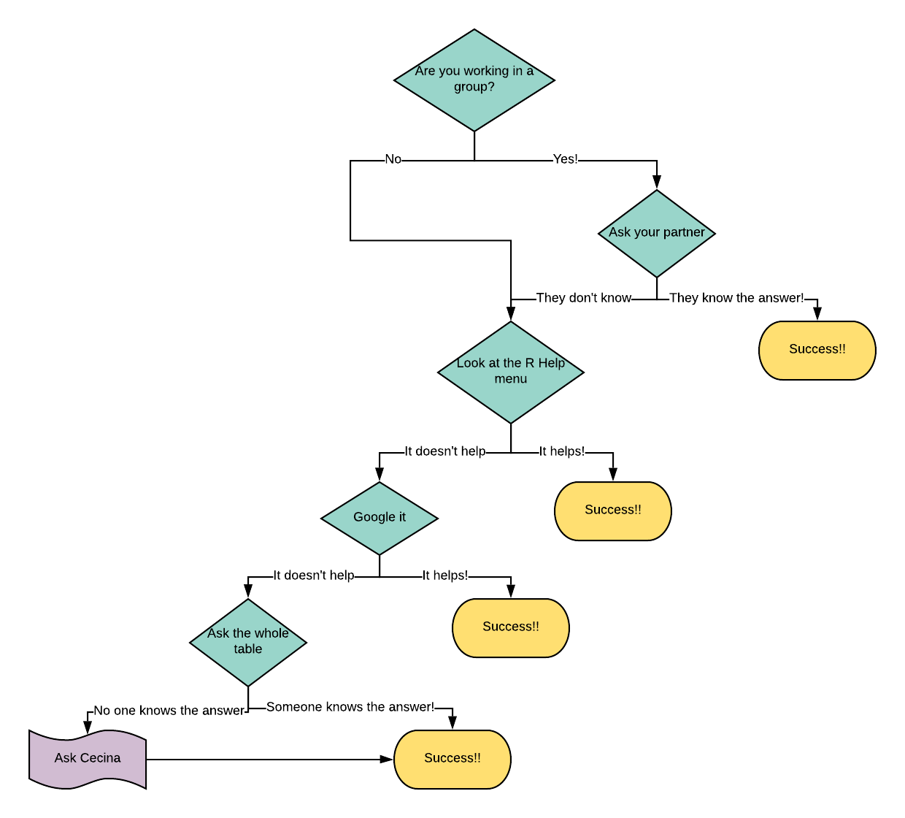

# What do you do if you're stuck?

A big part of coding is learning how to use different resources in order to solve your problems - make sure you're using all of your resources (your teammates, R, Google, me, etc.) effectively! 
If you need help with a certain function, line of code, error message, or really anything coding related, you can follow these steps to figure out a solution. 

