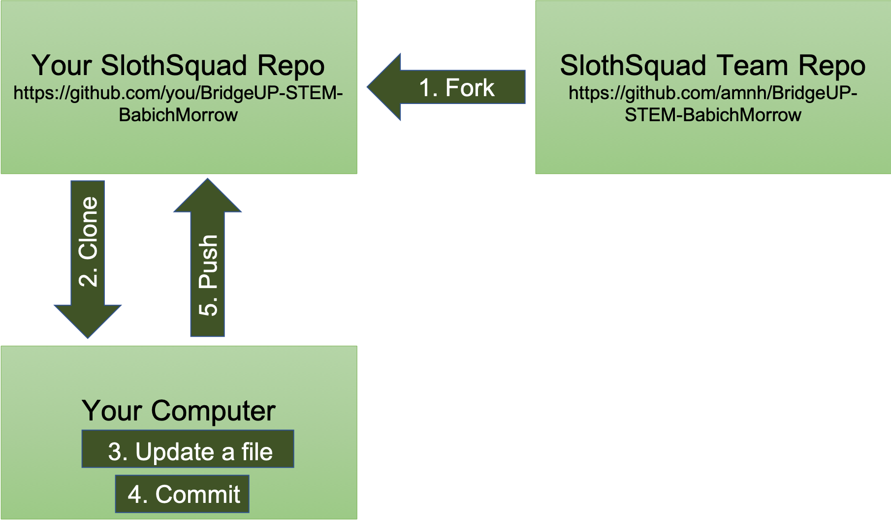

# Working on Forks :fork_and_knife:

## Beginning of Session

Push your local changes:

+ Open Terminal and navigate to your folder for the forked repository
  + `pwd`: check current directory
  + `ls`: get a list of files in the current directory
  + `cd`: move to a new directory
+ See current status of Git: `git status`
+ If you have modified files, commit your changes
  + `git add .` to add all untracked files to your commit
  + Once you've added all the files, `git commit -m "whatever you want your message to be"`
+ Push your changes to your remote copy of the fork: `git push`

Sync your fork:

+ Fetch commits from upstream repository to get any updates: `git fetch upstream`
+ Check out your fork's local `master` branch: `git checkout master`
+ Merge the changes from `upstream/master` into your local `master` branch: `git merge upstream/master`
  + Will need to hit the escape key, then type `:wq` to get out of the text editor for the commit
+ Run `git push` one final time to push the merged changes to your remote fork

## End of Session

Push your local changes:

+ See current status of Git: `git status`
+ If you have modified files, commit your changes
  + `git add .` to add all untracked files to your commit
  + Once you've added all the files, `git commit -m "whatever you want your message to be"`
+ Push your changes to your remote copy of the fork: `git push`
