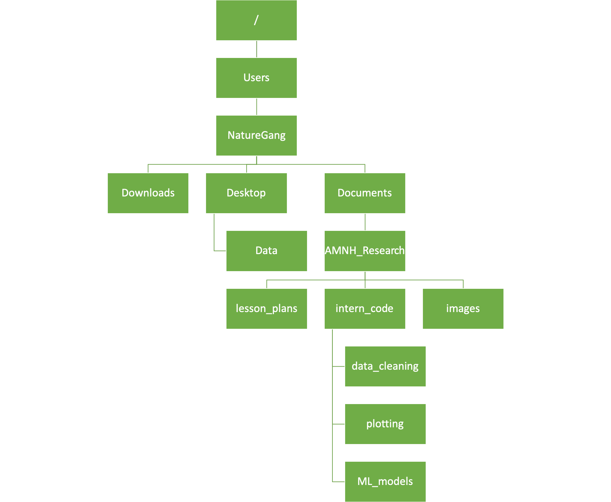

# The Path Game!

This game has been adapted from instructions written by Alexandra Walling (2017 Helen Fellow).

## Goals

1. Explain the difference between absolute and relative paths.
2. Use your knowledge of absolute and relative paths to navigate through a Linux-based file system game board.
3. Work in teams to write correct code for moving and copying files.

## Bash Commands to Know

I've added a Linux cheatsheet from threenine.co.uk to this repository: https://github.com/amnh/BridgeUP-STEM-BabichMorrow/blob/master/lesson_plans/File_Paths/Linux-Reference-1.pdf. There are other cheatsheets available online, so if this one doesn't quite suit you, feel free to look around for others. We will be mostly focusing on the "File Commands" section of this cheatsheet, so take a look at those commands. You have used some of these commands already when using Git -- which ones look familiar? Which ones don't? Do you see any that look particularly useful?

## Rules

You're going to work in two teams where you rotate from being The File, The User, and The Navigator.

1. The Game Master will give the first team a prompt indicating where The File and The User should be on the game board.

2. The Navigator will write a command on the whiteboard, which will tell The User and The File where to move on the game board. If this command doesn't produce the desired result, The Game Master will declare an Error.

    a) If the command works, the team gets a point!
  
    b) If an Error is declared, the opposing team will have a chance to write a command to fulfill the prompt and earn a point.
    
3. The second team will now play a round of the game.

4. After both teams play a round, the team members originally playing The File will become The User, The User will become The Navigator, and The Navigator will become the file.

5. Whichever team ends up with the most points wins!

## The Game Board

This is the game board you'll see on the floor.

### Example Challenges

Here are some examples of the types of challenges and commands you could use to solve them. Keep in mind, there are lots of different ways to solve most of these.

+ User starts in `Users`. Copy File from `Downloads` to `Documents`.
    + `cp ./NatureGang/Downloads/File ./NatureGang/Documents/File`
+ User starts in `AMNH_Research`. Move file from `images` to `intern_code`.
    + `mv ./images/File ./intern_code/File`
