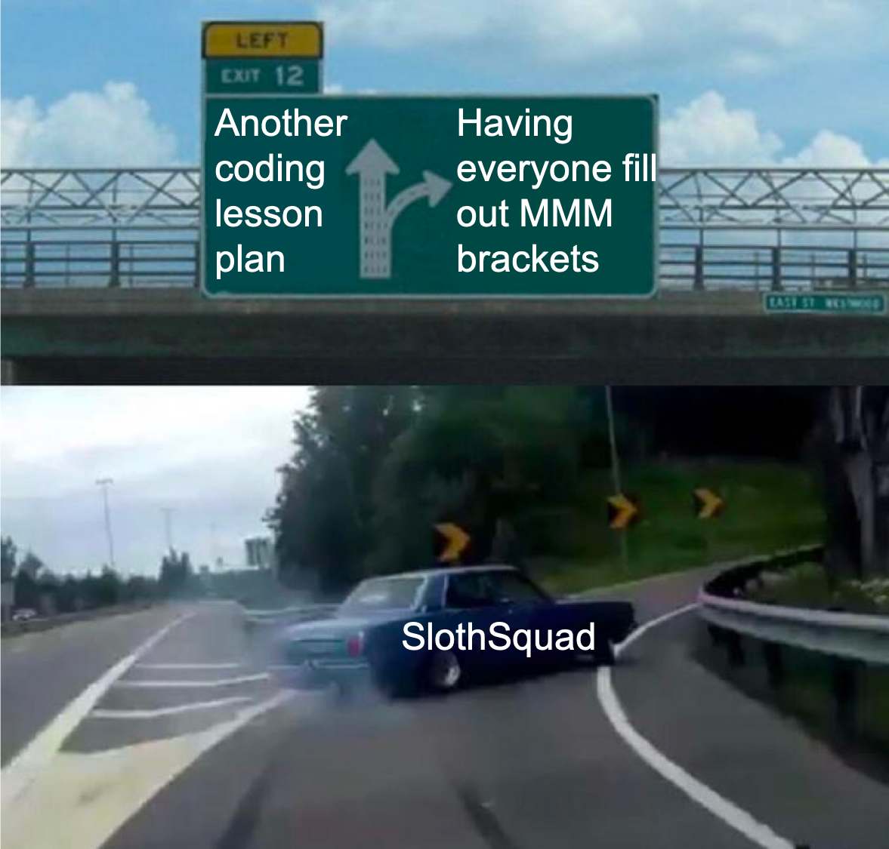

# March Mammal Madness!!!

In lieu of starting on another step of Maxent today, we are going to take a brief detour into the wonderful world of March Mammal Madness (MMM). For some background, MMM was created in 2013 by [Dr. Katie Hinde](https://isearch.asu.edu/profile/2740008), who is a professor at Arizona State University (and studies milk!). It piggybacks (:pig2:) on the NCAA basketball tournament by taking a scientific twist on bracketology to encourage learning about different organisms (which are not all mammals). As members of the SlothSquad, I thought we should fill out a somewhat belated bracket to learn some more about different kinds of mammals and get thinking broadly about ecology.

## Background

[This blog post](https://mammalssuck.blogspot.com/2019/02/march-mammal-madness-2019.html) by Katie Hinde has the official run-down of the tournament this year, including FAQs, descriptions of the divisions (summarized below), and a calendar with the dates of the tournament. You don't need to read over the whole thing, but make sure you check out the FAQs, particularly the one about how winners are determined.

## The Bracket

The [MMM bracket](https://4.bp.blogspot.com/-QTlj0lsSOgY/XHkrOftSPEI/AAAAAAAAIbo/MSsC9NRpiKUtAQHiwozeNK3WXS_XtBYYQCLcBGAs/s1600/Mammal%2BMarch%2BMadness%2B2019%2BBracket%2Bv1_1%2BPNG.png) is split up into 4 divisions: this year those are (1) Jump Jump - animals with impressive hops, (2) Waterfalls - animals adapted to aquatic habitats, (3) Tag Team - different pairs of mutualists, and (4) CAT-e-gory - animals with feline namesakes. We are a few days late to the party, so the winners for both the Wild Card battle and the first round of the Jump Jump division are already completed, but fortunately there is still plenty of bracket left.

### Current state of the bracket

Although we are hopping (:rabbit2:) into this event a few days late, reading over the results of the first few battles should help you start thinking about what kind of factors are important in the tournament. Read over a couple of the following battles to get a sense of what characteristics propelled some contestants to victory, and which sent others home early.

#### Wild Card

You can read a summary of the Wild Card bout between the antlion and tiger beetle either at the beginning of the blog post or here on Twitter: https://twitter.com/c_n_anderson/status/1105269085007417344.

#### Jump Jump Division

For a recap of the first round of the Jump Jump division, you can check out this [video recap](https://www.youtube.com/watch?v=6dMWDkYOGuE) on Youtube or read the Twitter summary of each individual battle below:

+ Impala vs. klipspringer: https://twitter.com/AnneWHilborn/status/1106020655873417216
+ Sifaka vs. 9-banded armadillo: https://twitter.com/tinkeringprim8/status/1106015603641540608
+ Bharal vs. stoat: https://twitter.com/PKurnath/status/1106013924980215808
+ Serval vs. rock-wallaby: https://twitter.com/Mammals_Suck/status/1106006546960379905
+ Markhor vs. streaked-tenrec: https://twitter.com/am_anatiala/status/1106001028254760960
+ Bengal tiger vs. ringtail cat: https://twitter.com/MarcKissel/status/1105997083696349185
+ Spinner dolphin vs. spinifex hopping mouse: https://twitter.com/Drew_Lab/status/1105994464861011968
+ Jackrabbit vs. springhare: https://twitter.com/je_light/status/1105990824414842880

## Your turn

Now it's your turn to take a stab at the remaining portion of the bracket. As you research each round, keep in mind Dr. Hinde's advice: "Ecology, ecology, ecology". Remember that, in early rounds, battles take place in the habitat of the higher-ranked species (for example, spinner dolphin vs. spinifex hopping mouse took place in the ocean off the coast of Sri Lanka, which is not preferred mouse habitat). Later on, from Elite Trait onwards, battles occur randomly in one of four locations: mangrove, sand hills, thorn forest, or lake. Think about how the organisms might thrive (or not) in a variety of different habitats. Also, remember that battle is a loose term -- sometimes an animal will win without even noticing (which happened a couple of times in the Jump Jump division), other times winning is defined by monopolizing a given food source.

If you want to really dive in (:dolphin:) to some scientific research on these species, ASU Libraries created a [special issue](https://academic.oup.com/asm/pages/march_mammal_madness_2019) with information on 25 of the species in the bracket.
