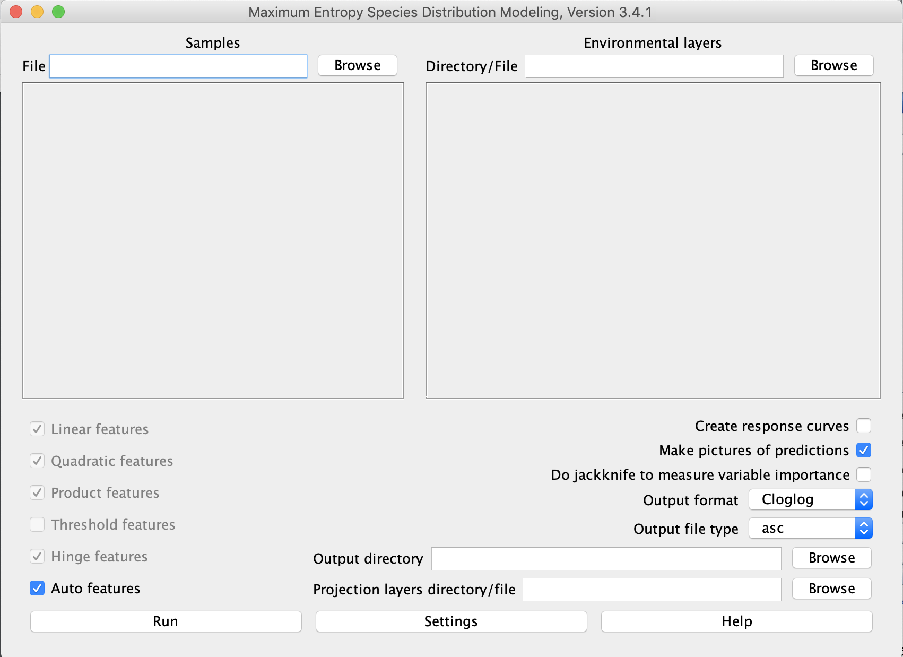

# Maxent Tutorial

This tutorial has been adapted from [this Maxent tutorial](https://biodiversityinformatics.amnh.org/open_source/maxent/Maxent_tutorial2017.pdf) by Steven J. Phillips.

## Getting started

### Downloading

Start off by downloading the Maxent software from [this link](https://biodiversityinformatics.amnh.org/open_source/maxent/).

### Firing up

You can open Maxent on your Mac by opening the maxent.jar file. You will see the following screen:

For this tutorial, you are going to perform Maxent on *Bradypus torquatus*. To perform a run, you need to supply a file containing presence localities, a directory containing environmental variables, and an output directory. Occurrence data has been provided in the `data/occurrence_data` folder (`torquatus.csv`) -- browse to that file location under the "Samples" heading. The environmental variables are in the `data/env_layers` folder -- browse to that file location under "Environmental Layers". Finally, I made a blank output folder for you in `intern_code/maxent_tutorial_outputs`, so browse to that location for "Output directory" (at the bottom).

For the occurrence data, the .csv file has three columns: `species`, `longitude`, and `latitude`: the "x" coordinate (longitude) should come before the "y" coordinate (latitude). You can have multiple species in the same samples file, but the one you are using today just includes *B. torquatus*. You can also use coordinate systems other than latitude and longitude as long as the samples and environmental layers use the same coordinate system. The program automatically removes duplicate records -- you can change this by clicking on "Settings" and deselecting "Remove duplicate presence records".

For the environmental data, we are using a number of ascii raster grids downloaded from [here](https://biodiversityinformatics.amnh.org/open_source/maxent/). The grids all need to have the same geographic bounds and cell size. One of the layers we are using, "ecoreg", is a categorical variable describing potential vegetation classes. You need to click on the menu next to "ecoreg" and change it from "Continuous" to "Categorical".

## Doing a run

Press the "Run" button. You'll see a progress bar telling you what step is going on. The "Gain" number you'll see is a statistical measurement of how well the model fits: it will start at 0 and increase asymptotically during the run. You don't need to worry too much about what gain means, but essentially at the end of the run, the gain will tell you how closely the model is concentrated around the presence samples. For example, if gain ends up at 2, the average likelihood of your presence occurrences is  times higher than a random background pixel.

After the run is complete, you will end up with multiple output files in `intern_code/maxent_tutorial_outputs`. The most important of these is an html file called `bradypus_torquatus.html`.

### Looking at a prediction

In the html file, scroll down to the heading "Pictures of the model". You can click on the image to make it larger. This map shows the predicted probability that condittions are suitable. You should see a narrow region of suitability predicted along the coast since *B. torquatus* is restricted to living in the Atlantic Forest of Brazil.

## Statistics

Now click on "Settings" and change "Random test percentage" to 25. Press "Run" again (you might have to select something like "Redo all" to make new output files). This modification tells the program to randomly set aside 25% of the sample records for testing (like we did for machine learning with the iris and sloth skull datasets).

## Which variables matter most?

## How does the prediction depend on the variables?

## Regularization

## Projection

## Further reading

### Output formats

Maxent supports four output formats for model values: raw, cumulative, logistic and cloglog. First, the
raw output is just the Maxent exponential model itself. Second, the cumulative value corresponding to a
raw value of r is the percentage of the Maxent distribution with raw value at most r. Cumulative output
is best interpreted in terms of predicted omission rate: if we set a cumulative threshold of c, the resulting
binary prediction would have omission rate c% on samples drawn from the Maxent distribution itself,
and we can predict a similar omission rate for samples drawn from the species distribution. Third, if c is
the exponential of the entropy of the maxent distribution, then the logistic value corresponding to a raw
value of r is c·r/(1+c·r). This is a logistic function, because the raw value is an exponential function of
the environmental variables. The cloglog value corresponding to a raw value of r is 1-exp(-c·r). The
four output formats are all monotonically related, but they are scaled differently, and have different
interpretations. The default output is cloglog, which is the easiest to conceptualize: it gives an estimate
between 0 and 1 of probability of presence. Note that probability of presence depends strongly on
details of the sampling design, such as the quadrat size and (for vagile organisms) observation time;
cloglog output estimates probability of presence assuming that the sampling design is such that typical
presence localities have an expected abundance of one individual per quadrat, which results in a
probability of presence of about 0.63. The picture of the Bradypus model above uses the logistic format,
which is very similar to cloglog output, but based on a different theoretical justification. 

